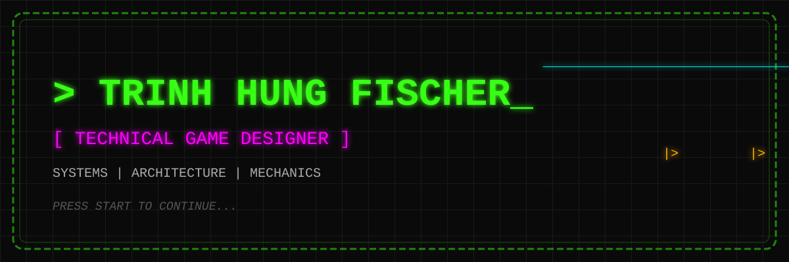
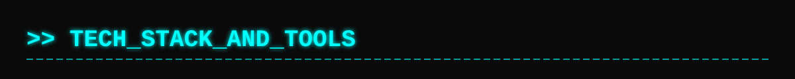
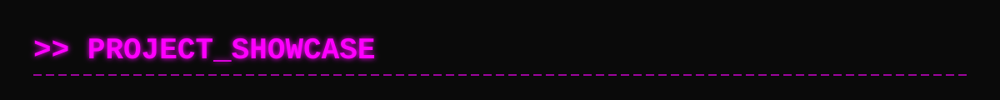

  

 

  
  
  
  

## `[ SYSTEM._BOOTING... ]`

Hi there, I'm **Trinh Hung Fischer**. 

I am a **Technical Game Designer**, focusing on the architecture behind the fun. While I have a keen eye for design, my true passion lies in building robust gameplay systems, architecting mechanics, and writing code that brings game worlds to life.

> <kbd>Core Gameplay Mechanics</kbd> | <kbd>Systems Architecture</kbd> | <kbd>Tools Programming</kbd>

---

### `> Languages & Frameworks`

  
  
  
  

### `> Game Engines & Tools`

  
  
  
  

---

  
> **[ PLACEHOLDER - AWAITING DATA INPUT ]**
> 
> *Showcase sections will be populated with technical breakdowns of game systems, architecture diagrams, and tool scripts.*

| 🕹️ **Inventory & Item System Architecture** | 👾 **Custom Behavior Tree Implementation** |
| :---: | :---: |
| *Building a scalable, data-driven item system.* | *A lightweight AI decision framework.* |
| [➡️ View Repository](#) | [➡️ View Repository](#) |

---

  <h3><code>> DATA_ANALYTICS</code></h3>
  
   
  

 

  <i>"Designing the rules, coding the reality."</i>  

